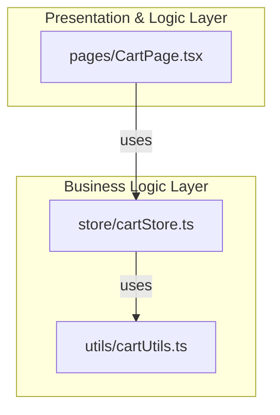

# 장바구니 웹페이지 모듈화 설계

단순화된 아키텍처로 구현한 장바구니 기능입니다.

## 🏗️ 프로젝트 구조

```
practice/
├── app/
│   ├── cart/
│   │   └── page.tsx              # 장바구니 페이지 (UI 컴포넌트)
│   └── types/
│       └── cart.ts                # 타입 정의
├── store/
│   └── cartStore.ts               # Zustand 상태 관리 스토어
├── utils/
│   └── cartUtils.ts               # 순수 계산 함수
└── __tests__/
    ├── store/
    │   └── cartStore.test.ts      # 스토어 테스트
    └── utils/
        └── cartUtils.test.ts      # 유틸 함수 테스트
```

## 📦 기술 스택

- **Framework**: Next.js 16 (App Router)
- **State Management**: Zustand 5
- **Styling**: Tailwind CSS 4
- **Language**: TypeScript 5
- **Testing**: Jest + React Testing Library

## 🎯 주요 기능

### 1. 상품 목록 조회
- 장바구니에 담긴 상품 목록 확인
- 상품 정보: 이름, 가격, 수량, 이미지

### 2. 상품 선택/해제
- 전체 선택/해제 기능
- 개별 상품 선택/해제
- 선택 상태에 따른 실시간 금액 업데이트

### 3. 수량 조절
- 수량 증가/감소 버튼
- 최소 수량 1 제한
- 수량 변경 시 자동 금액 재계산

### 4. 상품 삭제
- 개별 상품 삭제 기능
- 삭제 시 목록 및 금액 자동 업데이트

### 5. 주문 요약
- 선택된 상품 금액 계산
- 배송비 계산 (3,000원, 50,000원 이상 무료)
- 무료배송 조건 안내 메시지
- 최종 결제 금액 표시
- OP 적립 예정 (0P 고정)

### 6. 주문하기
- 선택된 상품 개수 표시
- 미선택 시 버튼 비활성화

## 🚀 시작하기

### 1. 의존성 설치

```bash
npm install
```

### 2. 개발 서버 실행

```bash
npm run dev
```

브라우저에서 `http://localhost:3000/cart`를 열어 장바구니 페이지를 확인하세요.

### 3. 테스트 실행

```bash
npm test
```

### 4. 빌드

```bash
npm run build
```

## 📐 아키텍처 설계

### 레이어 구조



### 데이터 흐름

```
User Interaction
    ↓
CartPage (UI)
    ↓
CartStore (State Management)
    ↓
CartUtils (Pure Functions)
    ↓
State Update
    ↓
UI Re-render
```

## 🧩 모듈 설명

### 1. `app/types/cart.ts`
장바구니 관련 타입 정의를 포함합니다.

- `CartItem`: 상품 아이템 타입
- `CartState`: 장바구니 상태 타입
- `CartActions`: 장바구니 액션 타입
- `CartSelectors`: 파생 상태 타입

### 2. `utils/cartUtils.ts`
순수 계산 함수들을 모아놓은 유틸리티 모듈입니다.

**함수 목록:**
- `calculateTotalProductPrice()`: 선택된 상품들의 총 가격 계산
- `calculateDeliveryFee()`: 배송비 계산
- `calculateFreeDeliveryRemainingAmount()`: 무료배송까지 남은 금액 계산
- `calculateTotalPaymentPrice()`: 최종 결제 금액 계산
- `getSelectedItemCount()`: 선택된 상품 개수 계산
- `isAllItemsSelected()`: 모든 상품 선택 여부 확인
- `getSelectedItems()`: 선택된 상품 목록 반환

### 3. `store/cartStore.ts`
Zustand를 사용한 상태 관리 스토어입니다.

**State:**
- `items`: 장바구니 상품 배열
- `isLoading`: 데이터 로딩 상태
- `error`: 에러 메시지

**Actions:**
- `initCart()`: 초기 데이터 로드
- `toggleItemSelection()`: 특정 상품 선택/해제
- `toggleAllItemsSelection()`: 모든 상품 선택/해제
- `updateItemQuantity()`: 특정 상품 수량 업데이트
- `removeItem()`: 특정 상품 삭제

**Selectors (Derived State):**
- `selectedItems`: 선택된 상품 목록
- `totalProductPrice`: 선택된 상품들의 총 가격
- `deliveryFee`: 배송비
- `freeDeliveryRemainingAmount`: 무료배송까지 남은 금액
- `totalPaymentPrice`: 최종 결제 금액
- `totalItemCount`: 전체 장바구니 상품 개수
- `totalSelectedItemCount`: 선택된 상품 개수
- `isAllItemsSelected`: 모든 상품 선택 여부

### 4. `app/cart/page.tsx`
장바구니 페이지의 최상위 컨테이너 컴포넌트입니다.

**책임:**
- 모든 UI 요소 렌더링
- `cartStore` 상태 구독 및 액션 호출
- 사용자 상호작용 처리
- 로딩 및 에러 상태 UI 표시

## 🧪 테스트

### Unit Tests

#### `utils/cartUtils.test.ts`
순수 계산 함수들의 유닛 테스트를 포함합니다.

**테스트 케이스:**
- 선택된 상품들의 총 가격 계산
- 배송비 계산 (50,000원 기준)
- 무료배송까지 남은 금액 계산
- 최종 결제 금액 계산
- 선택된 상품 개수 계산
- 모든 상품 선택 여부 확인
- 선택된 상품 목록 반환

#### `store/cartStore.test.ts`
Zustand 스토어의 유닛 테스트를 포함합니다.

**테스트 케이스:**
- 초기 상태 확인
- 상품 선택/해제 동작
- 전체 선택/해제 동작
- 수량 업데이트 (최소 1 제한 포함)
- 상품 삭제
- 초기 데이터 로드 (비동기)
- 파생 상태 계산 (Selectors)

### 테스트 실행

```bash
# 전체 테스트 실행
npm test

# Watch 모드로 실행
npm run test:watch
```

## 📋 QA 체크리스트

### UI/UX
- [ ] TC_CART_001: 페이지 접속 시 "장바구니" 타이틀과 "총 N개의 상품이 담겨있습니다." 메시지가 올바르게 표시되는가?
- [ ] TC_CART_002: 데이터 로딩 중 로딩 스피너가 표시되는가?
- [ ] TC_CART_003: 에러 발생 시 에러 메시지가 사용자에게 표시되는가?
- [ ] TC_CART_004: 초기 로드 시 장바구니 상품 목록과 주문 요약 정보가 올바르게 렌더링되는가?

### 선택 기능
- [ ] TC_CART_005: "전체 선택 (0/4)" 체크박스가 초기 상태에서 해제되어 있고, 클릭 시 모든 상품 선택/해제 및 텍스트 업데이트가 올바르게 작동하는가?
- [ ] TC_CART_006: 각 상품의 체크박스 클릭 시 해당 상품만 선택/해제되고, 주문 요약 정보가 즉시 업데이트되는가?

### 수량 조절
- [ ] TC_CART_007: 각 상품의 수량 감소/증가 버튼 클릭 시 수량이 변경되고, 해당 상품의 총 가격 및 주문 요약 정보가 즉시 업데이트되는가?
- [ ] TC_CART_007_1: 수량 1 미만 방지가 올바르게 작동하는가?

### 삭제 기능
- [ ] TC_CART_008: 각 상품의 삭제 버튼 클릭 시 상품이 목록에서 제거되고, 총 상품 개수 및 주문 요약 정보가 즉시 업데이트되는가?

### 금액 계산
- [ ] TC_CART_009: 주문 요약 섹션의 "상품 금액", "배송비", "총 결제 금액"이 선택된 상품에 따라 올바르게 계산되어 표시되는가?
- [ ] TC_CART_010: 선택된 상품의 총 금액이 50,000원 미만일 때 "X원 더 구매하시면 무료배송입니다!" 메시지가 올바르게 표시되고, 50,000원 이상일 때 "무료배송!" 메시지로 변경되는가?

### 주문 버튼
- [ ] TC_CART_011: 상품이 하나도 선택되지 않았을 때 "상품을 선택해주세요" 버튼이 비활성화 상태이고, 하나라도 선택되면 활성화되는가?

## 🎨 UI 디자인

### 색상 스키마
- Primary: Blue (주문 버튼, 총 결제 금액)
- Success: Green (무료배송 메시지)
- Warning: Blue (무료배송 안내)
- Danger: Red (삭제 아이콘)
- Neutral: Gray (텍스트, 배경)

### 반응형 디자인
- 모바일: 1열 레이아웃
- 데스크톱: 2:1 그리드 (상품 목록 : 주문 요약)

## 🔄 상태 관리 전략

### Zustand 선택 이유
1. **단순성**: Redux보다 훨씬 간단한 API
2. **성능**: 필요한 상태만 구독하여 불필요한 리렌더링 방지
3. **타입 안정성**: TypeScript와 완벽한 통합
4. **번들 크기**: 경량 라이브러리 (약 3KB)

### 최적화 포인트
1. **개별 셀렉터 훅**: 각 상태를 개별적으로 구독하여 불필요한 리렌더링 방지
2. **순수 함수 분리**: 비즈니스 로직을 순수 함수로 분리하여 테스트 용이성 향상
3. **Lazy Evaluation**: Getter를 사용한 파생 상태의 지연 계산

## 📝 개발 노트

### 설계 원칙
1. **단순성 우선**: 불필요한 추상화 제거
2. **관심사 분리**: UI, 상태 관리, 비즈니스 로직 명확히 분리
3. **테스트 용이성**: 순수 함수 위주로 구성하여 테스트 작성 용이
4. **타입 안정성**: 모든 데이터 구조에 타입 정의

### Mock 데이터
현재는 `cartStore.ts`에 하드코딩된 Mock 데이터를 사용합니다.
실제 프로덕션에서는 다음과 같이 변경할 수 있습니다:

```typescript
// store/cartStore.ts
initCart: async () => {
  set({ isLoading: true, error: null });
  
  try {
    const response = await fetch('/api/cart');
    const data = await response.json();
    set({ items: data.items, isLoading: false });
  } catch (error) {
    set({ 
      error: '장바구니 데이터를 불러오는데 실패했습니다.', 
      isLoading: false 
    });
  }
},
```

## 🚧 향후 개선사항

### 기능
- [ ] 찜하기 기능
- [ ] 쿠폰 적용
- [ ] 실제 OP 적립 로직
- [ ] 최근 본 상품
- [ ] 연관 상품 추천

### 성능
- [ ] 가상 스크롤링 (상품 개수가 많을 경우)
- [ ] 이미지 최적화 (Next.js Image 컴포넌트)
- [ ] 낙관적 업데이트 (Optimistic Updates)

### UX
- [ ] 상품 삭제 확인 모달
- [ ] Undo 기능
- [ ] 드래그 앤 드롭으로 순서 변경
- [ ] 상품 비교 기능

## 📄 라이선스

MIT License

## 👥 기여

기여는 언제나 환영합니다! 이슈나 PR을 자유롭게 남겨주세요.

---

**Made with ❤️ using Next.js & Zustand**


